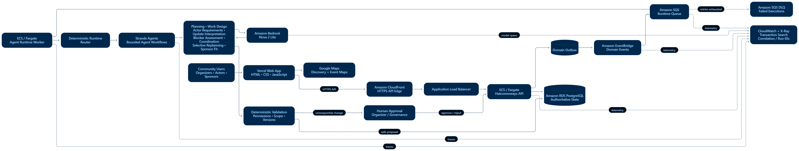

# Hatcommways

> From “someone should” to “we did.”

Community action becomes visible. The Explore map helps people discover nearby events, understand their themes and locations, and find where they can participate.

Hatcommways is an AI-powered community execution platform. It turns real-world goals into a work graph, timeline, and project-specific responsibilities. People, communities, organizations, and sponsors choose how they contribute; bounded agents help reason about dependencies, resources, blockers, and changes. People retain authority over commitments and consequential decisions.

**Implemented and deployed:** [Web app](https://hatcommways.vercel.app) · [API health](https://d2zg0c0ne74fcr.cloudfront.net/health) · [Demo](docs/demo.md) · [Documentation index](docs/README.md)

## The Problem

Willingness to help is only the beginning. People need to discover action, understand the work, find a role that fits their availability, and obtain resources. Once execution starts, late arrivals, unavailable equipment, and dependencies can disrupt a plan. Organizers need to respond without losing accountability or rebuilding everything.

The current system preserves event-specific plans, reports, assessments and decisions. Reusable cross-community learning is a future direction.

## What Hatcommways Does

| Role | Implemented journey |
| --- | --- |
| Organizers | Create goals/events, configure governance, generate and review stages/work/actor requirements, configure resources, review participation and sponsor offers, monitor execution, interpret updates, assess blockers, coordinate affected work, and approve/reject selective replanning. |
| Participants / actors | Discover events, select work/roles, provide availability, review guidance and submit requests. Approved actors view assignments, timing, meetings and map context in their dashboard, report changes, and receive authoritative updates. |
| Sponsors / organizations | Discover through normal Explore, inspect Resources & Sponsors, offer equipment/material/transport/logistics support, and view My Sponsorships with public approved contributions and private owner-only records. |
| Wider community | Discover public events and view permitted event/sponsor context. Public visibility remains subject to current API authentication requirements. |

Explore remains shared discovery. My Sponsorships is not a replacement for Explore.

## What Makes It Different

Discovery, registration and communication help people get started. Community execution also needs work design and a response to changing conditions. Hatcommways connects:

**Goal → work design → responsibilities → participation → resources and sponsor support → execution → blockers → coordination → selective replanning → progress toward an outcome.**

**Humans make commitments and decisions. Agents keep commitments coordinated.** This means bounded reasoning and proposals, not autonomous governance or automatic proof of completion.

## Architecture

Vercel hosts the static HTML/CSS/JavaScript frontend. HTTPS API traffic passes through CloudFront and an Application Load Balancer to FastAPI on ECS/Fargate. Amazon RDS PostgreSQL is authoritative. Google Maps provides discovery, operational context, and approved sponsor contribution locations.

Registered asynchronous workflows send transactional outbox events through EventBridge and SQS to an ECS/Fargate worker. A deterministic router invokes bounded Strands workflows backed by Amazon Bedrock Nova 2 Lite. Typed results pass domain validation before persistence. CloudWatch and X-Ray/Transaction Search provide execution evidence.

The diagram groups implemented capabilities. **Not every capability is queue-dispatched:** the production worker registers Coordination and Sponsor Fit; other capabilities use API/application workflow paths. See [architecture](docs/architecture.md), [agents](docs/agents.md), and [runtime](docs/runtime.md).

## Human Authority and Strands Agents

| Boundary | Responsibility |
| --- | --- |
| Agents | Interpret, assess, reason, recommend and propose within supplied context. |
| Deterministic services | Authorize, validate IDs/scope/versions/lifecycle rules, persist authoritative state and apply transactions. |
| People | Commit to roles, govern, approve/reject offers and changes, and confirm real-world conditions. |

Implemented reasoning capabilities include Event Planning, Work Design, Actor Requirements, Governance Assessment, Participation Guidance, Human Update Interpretation, Blocker Assessment, Coordination, Selective Replanning and Sponsor Fit. They use the **Strands Agents SDK**, scoped context, typed models and Bedrock model `us.amazon.nova-2-lite-v1:0`. Participation guidance also has a deterministic implementation; configuration matters. The affected-work resolver is deterministic, not another agent.

Agents cannot invent authoritative completion. Human confirmation or an implemented integration must establish real-world truth; there is no general automatic outcome-verification system.

## Selective Replanning

**Human update → interpretation → blocker assessment → deterministic affected-work resolution → coordination → replanning only when needed → organizer approval.**

A change does not regenerate the whole plan. Unrelated work remains frozen; approved affected execution state is synchronized transactionally. Ordinary lateness is not automatically a blocker. Coordination can be sufficient without replanning: the organizer explicitly marks handling WORKING while condition remains OPEN, then clears the condition later. Replan approval does not itself clear a blocker. [Execution details](docs/execution-and-replanning.md)

## Sponsor Support

**Explore → Event → Resources & Sponsors → Support This Event → PENDING offer.**

Submission writes the offer, notification and `support_offer.submitted` outbox record transactionally. EventBridge → SQS → ECS worker → Strands Sponsor Fit → Bedrock Nova produces a typed persisted advisory. The organizer follows the notification to the exact offer and accepts or rejects it.

APPROVED offers are the contribution ledger. Approval validates the current need transactionally; pledged/remaining quantities are derived from approved offers, not a second mutable counter. Pending/rejected offers do not count. Sponsor Fit cannot accept offers or mutate quantities. Payment processing is not implied.

My Sponsorships shows approved public map/highlights. Only the owner receives detailed offers, including pending/rejected records and private comments. [Sponsor contract](docs/sponsor-support.md)

## Governance and Maps

Governance is human-led. Assessments surface risks, policy concerns, missing approvals and decision context; people remain the authority. [Governance](docs/governance.md)

- **Explore map:** public discovery; remote events remain searchable regardless of the viewer's city.
- **Event map:** visibility-filtered operational context, not guaranteed live tracking.
- **Sponsor map:** approved public contribution history using existing coordinates and fitted bounds.

Missing Maps configuration/locations does not remove lists or links. Browser geolocation supports discovery UX and is not persisted as participant location. [Maps](docs/maps-and-visibility.md)

## Repository and Local Setup

| Path | Contents |
| --- | --- |
| `apps/web/` | Static pages, authentication/configuration and maps. |
| `services/api/`, `services/auth/` | FastAPI composition, accounts, sessions and authorization. |
| `services/planning_foundation/` | PostgreSQL schema, domain models, validation, transactions and read models. |
| `services/agent_runtime/` | Strands workflows, outbox transport, router and worker. |
| `tests/`, `docs/` | Focused checks, implementation guides and labeled design history. |

Use Python 3.13, PostgreSQL and Node.js for config generation. Install both service requirements files and the Uvicorn version in the Dockerfile. Set `HATCOMMWAYS_DATABASE_URL` to your own development connection; never commit it. Run `python -m uvicorn services.api.main:app --host 127.0.0.1 --port 8000`. Startup applies the schema, so use a dedicated development database.

Set `HATCOMMWAYS_API_BASE=http://127.0.0.1:8000`; run `node apps/web/generate-runtime-config.mjs`, then `python -m http.server 3000 --directory apps/web`. Maps need the browser key and map ID. [Deployment/config](docs/deployment.md)

Tests under `tests/planning_foundation/` clear their configured database: **use a disposable test database, never production or your demo database.**

## Demo and Evidence

[Watch the demo video on Vimeo](https://vimeo.com/1226772984).

Follow [the demo](docs/demo.md). Show persisted proposals and human decisions rather than forcing a replan. [Observability](docs/observability.md) explains message, correlation, run and trace IDs. The [dated sponsor deployment record](docs/sponsor-deployment-20260914.md) preserves earlier queue-to-model evidence.

## What's Next

Future work includes human-led governance expansion, richer sponsor coordination, cross-community collaboration, outcome tracking, templates and **Hatcommways Memory Map**: reusable work structures, coordination patterns, bottlenecks, sponsor/resource patterns, governance decisions, failures and project blueprints. These are directions, not completed features.

## License

This project is licensed under the MIT License. See [LICENSE](LICENSE) for details.
